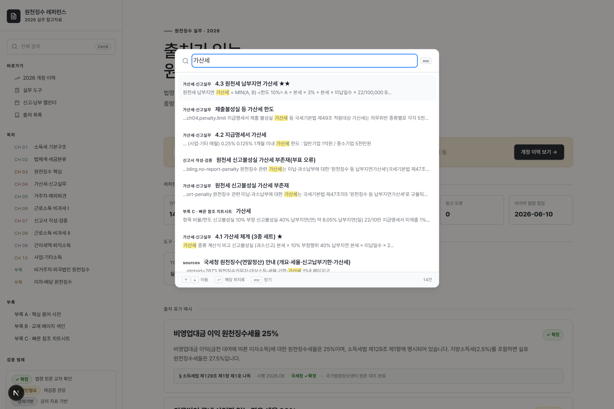
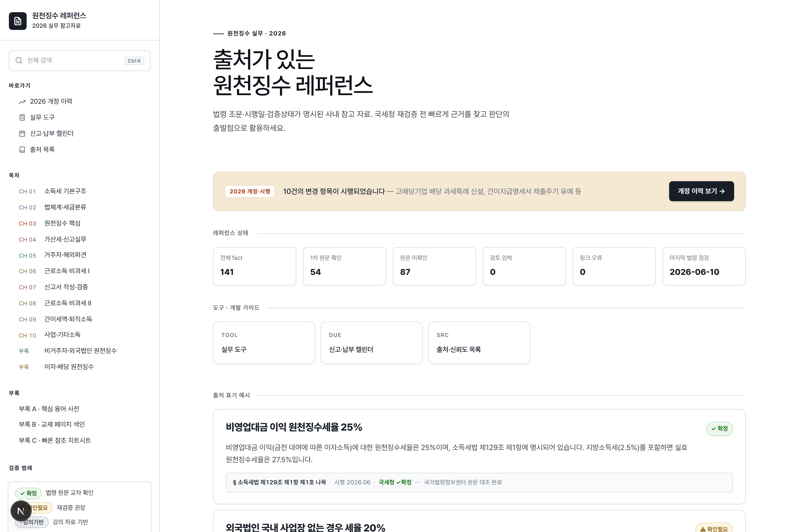
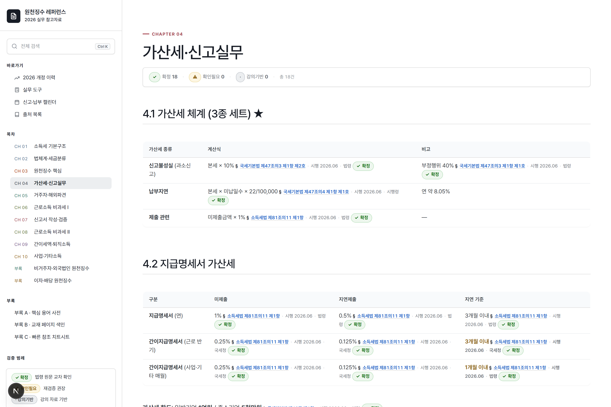
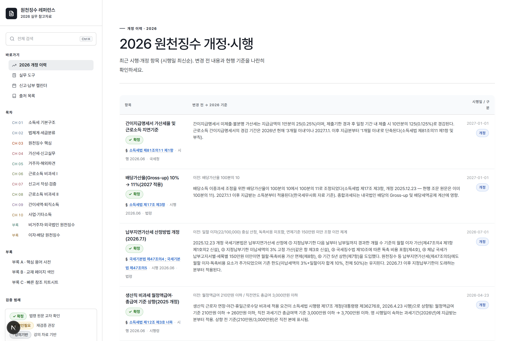
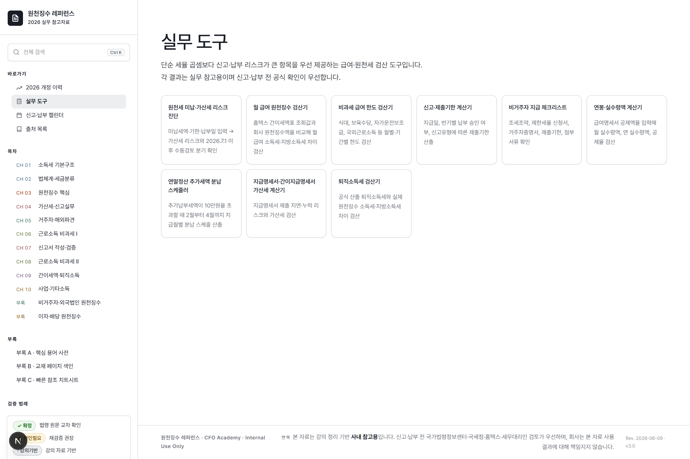

<div align="center">

# 원천징수 레퍼런스

### 출처가 있는 원천징수 실무 레퍼런스 — *AI 재검증 루프를 끝내는 사내 세무 참고 사이트*

법령 조문 · 시행일 · 검증상태가 **모든 핵심 사실에 박혀 있는** 정적 웹 레퍼런스.
국세청에 한 번 더 확인하지 않아도 되도록, 출처를 1급 기능으로 만들었습니다.

`Next.js 16` · `TypeScript` · `Tailwind v4` · `MDX` · `zod` · `Vercel-ready` · `DB 없음`

</div>

<div align="center">
  
  <br/>
  <sub><strong>전체 본문 검색</strong> — 어느 페이지서든 <code>Ctrl+K</code>로 12개 장 전체를 검색하고, 결과를 누르면 <strong>해당 장의 정확한 섹션으로 바로 이동</strong>합니다.</sub>
</div>

<div align="center">
  
  <br/>
  <sub><strong>레퍼런스 상태 대시보드</strong> — 전체 fact·1차 원문 확인·검토 임박·링크 오류를 홈에서 한눈에.</sub>
</div>

---

## 왜 만들었나

인사시스템(HR) 개발사 내부에서 원천징수 지식이 필요한 순간 — ① 고객 질문에 **법적 근거** 제시 ② **화면 개발** 참고 ③ **연말정산** 프로젝트 — 마다 ChatGPT/Claude에 물었지만, AI가 **모르면서 아는 척**하거나 **옛 내용을 최신인 양** 답해서 **매번 책·국세청·홈택스로 한 번 더 검증**해야 했습니다.

이 재검증 루프를 없애는 게 목표입니다. 그래서 모든 검증 대상 사실에 **`§ 법령 조문 · 시행일 · 검증상태`** 를 붙였습니다.

> CFO Academy 「원천징수실무」(세무사 차재영·박교원 공저) 2일 강의 정리를 토대로, 2026년 기준 1차 출처(국가법령정보센터·국세청·예규)와 대조해 재검증했습니다.

---

## 핵심 — 출처가 곧 디자인

각 사실은 `<Fact>` 로 감싸여 **법률 인용 라인 + 검증상태 씰**과 함께 렌더됩니다. 장식이 아니라 신뢰의 본체입니다.

<div align="center">
  
  <br/>
  <sub>각 수치 옆 <code>§ 법령 조문 · 시행일 · ✓확정</code> 인용 라인과, 장 상단 <strong>이 장 검증: 확정 N · 확인필요 M · 강의기반 K</strong> 요약.</sub>
</div>

- **`§ 소득세법 제129조 제1항 · 시행 2026.06 · 국세청 ✓확정`** — 인용 라인이 모든 수치·세율·기한 옆에.
- **검증상태 3단**: `✓ 확정`(1차 출처 매칭) · `⚠ 확인필요`(재확인 권장) · `· 강의기반`(공식 출처 미확정).
- 챕터마다 **`이 장 검증: 확정 N · 확인필요 M`** 요약.

---

## 주요 기능

### 전체 본문 검색 (Ctrl+K) — 어디서든, 정확한 위치로
모든 장(12장 + 부록)의 본문을 섹션 단위로 색인합니다. 어느 페이지에서든 `Ctrl+K`(Mac은 `⌘K`) 또는 사이드바 "전체 검색"으로 명령 팔레트를 열어 검색하고, ↑↓·Enter로 이동하면 **그 장의 해당 섹션 앵커로 바로 스크롤**됩니다. 빌드타임 인덱스(MiniSearch) + `rehype-slug` 앵커로 결과와 본문 위치가 정확히 일치합니다.

### 2026 개정·시행 대시보드 — 올해 뭐 바뀌었나
`facts.json`에서 개정·신설 항목을 자동 수집. 변경 전 → 2026 기준 → 시행일 → 출처를 한 화면에.

<div align="center">
  
</div>

### 검토 임박 항목 — 재검토 큐
`nextReviewBy` 기준 정렬. 매년 시행규칙 개정 후 무엇을 다시 봐야 하는지.

### 검증된 표·콜아웃 — 가산세·신고실무
원본 강의의 표·비교·수식·콜아웃을 React 컴포넌트로 이식하고, 핵심 수치마다 인용을 연결(위 가산세·신고실무 캡처 참조).

### HR 화면 개발 가이드 (8종) — 세무 지식을 화면·필드·검증으로 번역
직원 세무 프로필 · 급여항목 마스터 · 월 급여 원천징수 · 연말정산 · 사업소득 지급/정산 · 비거주자 지급 · 신고 캘린더 · 가산세 계산기 — 화면별 **필드 명세(ScreenSpec) + 검증 규칙 + 경고 조건 + 근거 fact**를 제공합니다. `/screen-guides`

### rule 기반 계산기 · 신고 캘린더 — 실무 검산 도구 8종
`content/tax-rules/2026/*.json`(zod 검증, fact 연결 필수)을 데이터로 쓰는 검산 도구들 — **납부지연가산세 계산기**(3%+22/100,000·10% 한도·2026.7.1 개정 분기), **사업소득 3.3% 계산기**(국세·지방세 분리), 월 급여 원천징수·비과세 한도·퇴직소득·비거주자 지급 체크 등. 모든 결과에 적용 rule 버전과 근거 fact 인용이 붙습니다. 신고·납부 기한은 `/calendar`에서 주기별로 확인.

<div align="center">
  
</div>

### 그 외
- **전체 본문 검색(Ctrl+K)** · **인쇄**(출처 배지·시행일 유지) · **사이드바 색인** · **출처 신뢰도 목록**(`/sources`) · **법령 감시 목록**(watchlist, 2027 배당가산율 등).

---

## 콘텐츠 범위

원본 강의 **10개 장 + 부록 3종**에, 원본에 없던 **신규 2개 장**(비거주자·외국법인 / 이자·배당)을 1차 출처로 새로 조사·작성해 추가했습니다.

- **CH1~10**: 소득세 기본구조 · 법체계·세금분류 · 원천징수 핵심 · 가산세·신고실무 · 거주자·해외파견 · 근로소득 비과세 I/II · 신고서 작성·검증 · 간이세액·퇴직소득 · 사업·기타소득
- **신규 2장**: 비거주자·외국법인 원천징수 · 이자·배당 원천징수 (1차 출처 기반 신규 조사)
- **부록**: A 핵심 용어사전 · B 교재 페이지 색인 · C 빠른 참조 치트시트

---

## 신뢰 모델

검증 대상 사실은 `content/facts.json`에 구조화 데이터로 분리되어 있고 zod로 검증됩니다.

```jsonc
{
  "id": "f_c40003",
  "slug": "ch04.late-payment.daily-rate",
  "chapter": "ch4",
  "title": "납부지연가산세 1일 이자율",
  "claim": "납부지연가산세의 1일 이자율은 10만분의 22…",
  "sourceType": "EDICT",                 // LAW > EDICT > INTERPRETATION > NTS > BOOK > LECTURE > CASE
  "lawRef": "국세기본법 제47조의4 제1항 제1호",
  "lawUrl": "https://www.law.go.kr/…",
  "effectiveDate": "2022-02-15",
  "verifyStatus": "확정",                 // 확정 | 확인필요 | 강의기반
  "primarySourceVerified": true,         // 1차 원문 직접 확인 여부
  "confidenceScore": 88,
  "history": [{ "date": "2026-06-09", "author": "kms", "note": "…" }],
  "nextReviewBy": "2027-03-31"
}
```

**현재 검증 현황: 141개 사실 중 `확정 138` · `강의기반 3` · `확인필요 0`** (1차 원문 직접확인 54건).
2026-06-10 배치: 2025.12.23 공포 개정세법의 P0 항목 7건(사업소득 연말정산 분납 §144조의2②, 제한세율 신청서 세무서 제출의무 §156조의6④, 납부지연가산세 개정 §47조의4·5, 종신연금 3%, 이연퇴직 70/60/50%, 배당가산율 11%, 교육비 공제 확대)을 **국가법령정보 OPEN API로 현행 조문 원문을 직접 확인**해 추가했습니다.
1차 출처로 확정할 수 없는 항목(입법관행·계산 추정치·강의 항목번호 오인 가능)은 억지로 확정하지 않고 정직하게 `강의기반`으로 둡니다 — 그게 이 시스템의 신뢰성입니다.

수기 검토가 남은 항목은 [`docs/REVIEW-QUEUE.md`](docs/REVIEW-QUEUE.md)에 장별·우선순위(P0/P1/P2)로 정리되어 있습니다.

> ⚠️ **면책**: 본 자료는 강의 정리 기반 **사내 참고용**입니다. 신고·납부 전 국가법령정보센터·국세청·홈택스·세무대리인 검토가 우선하며, 회사는 본 자료 사용 결과에 책임지지 않습니다.

---

## 기술 스택

| 영역 | 선택 |
|---|---|
| 프레임워크 | Next.js 16 (App Router, **SSG**, DB 없음) |
| 언어/스타일 | TypeScript · Tailwind v4 (OKLCH 토큰) |
| 콘텐츠 | MDX 본문 + `facts.json`(zod 검증) 하이브리드, fact는 `<F id>`로 본문에 연결 |
| 폰트 | Hanken Grotesk(디스플레이) · Pretendard(본문) · JetBrains Mono(인용) |
| 검색 | MiniSearch (클라이언트, 빌드타임 인덱스) |
| 테스트 | Vitest + @testing-library (225 tests) |
| 배포 | Vercel (`git push` → 자동 빌드) |

---

## 실행

```bash
npm install
npm run dev          # http://localhost:3000  (Windows: webpack 사용)
npm run build        # 정적 빌드
npm test             # 225 tests
```

> Windows에서는 Turbopack 네이티브 바인딩 부재로 `dev`/`build`가 `--webpack`을 사용합니다. Vercel(Linux) 배포 시 `build:turbo`로 Turbopack 사용 가능.

---

## 프로젝트 구조

```
app/                    # 라우트: / · /ch/[slug] · /updates-2026 · /review-due
components/             # Fact · SourcePill · VerifyStatus · 콘텐츠 블록(Box/Tbl/Compare/…)
content/
  chapters/*.mdx        # 12장 + 부록 본문
  facts.json            # 검증 사실 저장소 (zod)
lib/facts/              # schema(zod) · store(헬퍼)
docs/
  REVIEW-QUEUE.md        # 세무 수기검토 큐 (P0/P1/P2)
  superpowers/plans/     # 설계·계획·파일럿 산출물
```

---

<div align="center">
<sub>강의 정리 기반 사내 참고 자료 · 2026 기준 · 신고·납부 전 공식 출처 확인 필수</sub>
</div>
